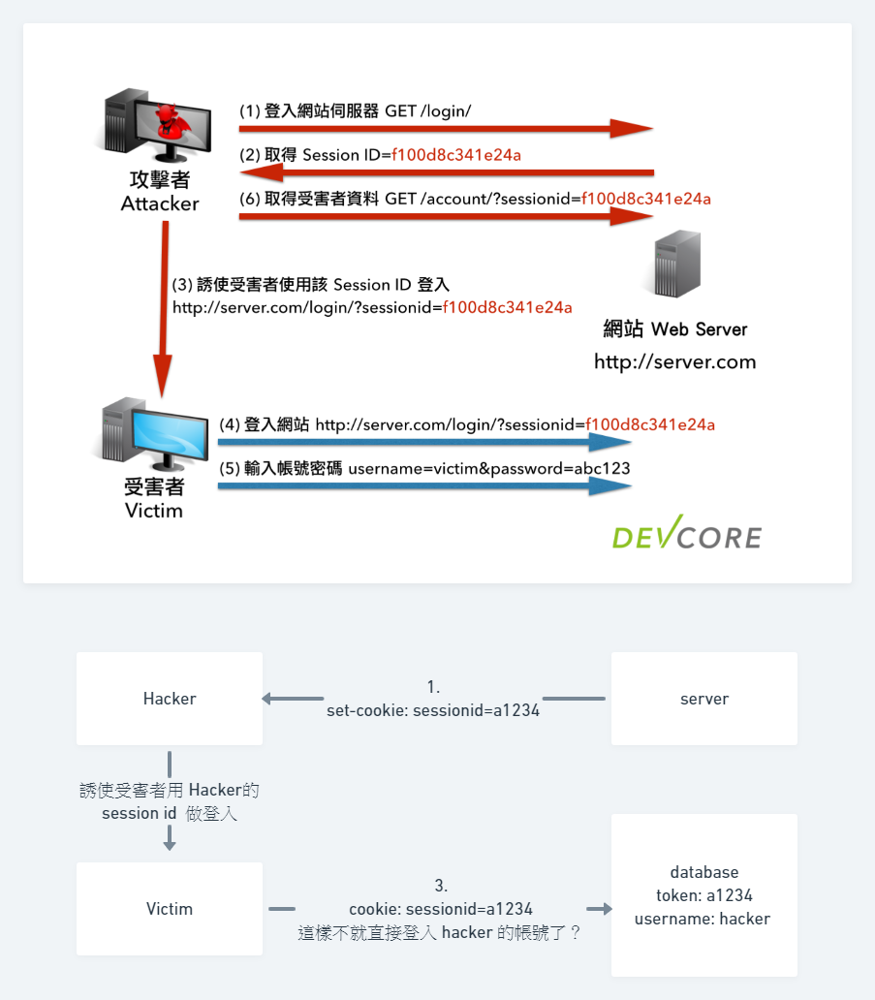
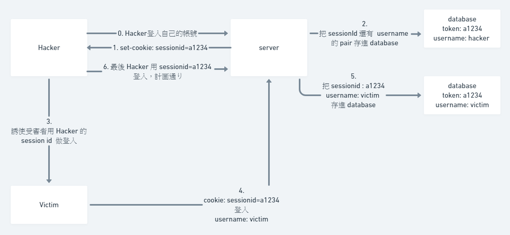
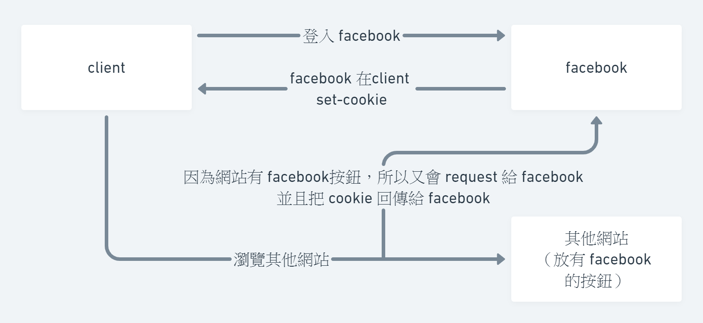
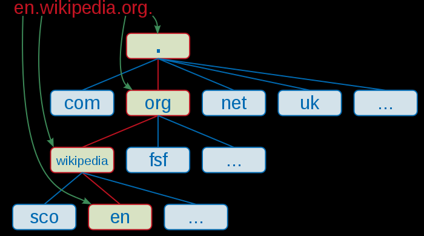

# 關於 session, coockie 的那些事情
## 從 server 還有  browser 說起
Server 傳送給 Browser 的 response 都是沒有狀態的（stateless），每次只要 Request，他就只會給你對應的 Response ，這是什麼意思？

簡單說 server ，就像一台販賣機，為什麼是販賣機呢？販賣機不像早餐店的阿姨，當你去你家巷子口的美而美的時候，老闆娘遠遠看到你就會大聲呼喊：「帥哥，今天還是一樣的薯餅蛋餅要胡椒不要油膏加大冰奶嗎？」，甚至當你們已經心有靈犀的時候：「今天老樣子嗎？」老闆娘總是記起來你吃甚麼，你昨天吃什麼，但販賣機不會。販賣機就是依照你所選的按鈕給你東西而已，永遠不會記說哪個客人選了幾號的飲料，而這就跟 server 一樣。server 只會依照你 request 所傳送的資料給你對應的 response。

但是有些時候我們會有這樣的需要：我們會希望 server 對於自己電腦所送出的 request 都有一個狀態。就像如果你是一個販賣機狂人，你可能會希望販賣機像早餐店老闆娘一樣，只要確定是你，就直接跳出你每次都選擇的那個飲料。

## 讓 server 記住這個 Request 是誰
要怎麼讓 server 可以記住我們 request 的狀態？

感覺可以試著想想，要怎麼讓販賣機可以跳出你最愛喝的那個飲料？很簡單嘛，這時候就該參考一下隔壁產業 - 湯姆熊裡面的街機，還記得頭文字 D 嗎？你可以買卡片來儲存你的紀錄，每次要玩之前都刷一下卡，就可以繼續上次的紀錄。

販賣機也可以模仿一下這個商業模式，給你一張販賣機的會員卡，或者是直接把資料存在你的悠遊卡裡面，當你要買飲料的時候就逼一下，販賣機就會跳出你喜歡的飲料了，不用猶豫的老半天，是不是很棒。

那假如販賣機真的可以做到這種事情，那資料應該會是怎麼流動的呢？我們先假設你有拿著一張空卡（沒有資料的卡）去販賣機。流程應該會是這樣：

1-1. 刷卡，然後點自己的飲料
1-2. 販賣機收到你點飲料的訊號了，讓你點的飲料掉下來，而在你的卡裡面說：這傢伙喜歡喝舒跑

然後你又去販賣機買了飲料

2-1. 刷卡，但是你知道說上次你資料在卡裡面了，所以不用點飲料
2-2. 販賣機收到你卡裡面的資料，直接掉出舒跑。 

其實 browser 還有 server 做的事情跟這個有 87% 像。暫且聽我娓娓道來，我們以最常使用狀態的理由：登入購物網站。

1-1. 當我們第一次登入購物網站的時候，我們輸入自己的帳號密碼
1-2. server 收到你的帳號密碼之後，確認你是會員，並且在你的 browser 中做一個記號說：我是

然後你去逛這個購物網站的其他頁面時

2-1. 傳送 request 要求商品的頁面，而且會把 server 做的記號也一併傳回去（販賣機的卡片）
2-2. server 收到你 request 中的記號，他知道你是金城武，是會員。所以就顯示下單的選項

剛剛講的內容中一直講到記號，那到底是什麼記號？那就是我們很常聽到的東西：cookie

## Cookie


應該每個人都有看過這樣標示吧？

裡面所提到的 cookies 就是一個儲存狀態的機制，也就是販賣機的會員卡，也就是剛剛購物網站做的記號。那 cookie 實際上是怎麼設置的呢？


剛剛提到 server 確認會員之後在你的 browser 做記號，實際上由兩個步驟所組成

1. response 的 header 中標記 Set-cookie 這個 header，格式是這樣 `Set-Cookie: <cookie-name>=<cookie-value>` 。

	```
	HTTP/2.0 200 OK
	Content-Type: text/html
	Set-Cookie: yummy_cookie=choco
	Set-Cookie: tasty_cookie=strawberry

	[page content]
	```
1. 當 browser 接收到 header ，發現裡面有 Set-cookie 後，會在儲存 cookies 在電腦上。

到這裡 server 就相當於儲存一個狀態在我們的電腦上了。

3. 再來，當我們傳送 Request 到 **相同 domain** 時，browser 會在 request 中設置對應的 header。

	```
	GET /sample_page.html HTTP/2.0
	Host: www.example.org
	Cookie: yummy_cookie=choco; tasty_cookie=strawberry
	```

4. 瀏覽器就會依照 cookie 的內容來知道說，喔~這個 ip 所傳送過來的 request 是有一些狀態的，來 response 相對東西。

大概是這樣，過程其實跟剛剛上面有會員卡機制的販賣機差不多。想要看看 cookie 的廬山真面目，我們可以打開  `devTools > Application` 。可以看到這些就是 server 在我們 browser 儲存的狀態。


我們可以看到表格中有 Name 跟 Value，而這就是 cookie 儲存的格式，另外值得注意的是 Expires，coockie 是會過期的，就像 cookie 一樣。在Set-Cookie 的時候會設置一個 lifetime。

```
Set-Cookie: id=a3fWa; Expires=Wed, 31 Oct 2021 07:28:00 GMT;
```

到期後 browser 就會自動把 cookie 刪除。

### cookie 會拿來做什麼呢？
最常見的就是會員機制了，最常見的就是會員機制了。

想像一下，當你輸入帳號密碼之後，然後到了會員中心之後，你要看一下購物車。因為 request 是沒有狀態的，你能夠進入會員中心是因為你在登入的 request 輸入了帳號跟密碼，但是你在購物車的頁面並沒有，所以你必須再點一次都入，再輸入一次帳號密碼。

但是這樣的使用者體驗極差啊，怎麼可能跳頁就輸入一次帳號密碼。所以才會利用 cookie 儲存會員的資料，server 只要看到說 request 裡面有 `user` 這個 cookie 就知道說這個 request 的主人已經登入過了。就不用重新登入。

其他運用這個原理的還有例如：主題的切換、個人設定、資料庫、遊戲分數等等。還有一樣很重要的應用：用戶資料追蹤。

關於用戶應用，可以看[這個影片](https://www.youtube.com/watch?v=QWw7Wd2gUJk) 了解。

## session 機制
### session 機制是甚麼？
那 sessnion 機制又是甚麼？session 這個詞是「會議」的意思（當然還有很多意思，或者是更適合的翻譯，但是我們不是英文課，抓個理解就可以）。假想你再登入會員的時候（假想就好，不是比喻，自己覺得實際運作的機制不太一樣），就好像你這個 client 跟 server 正在開會一樣，進入這個會議室後，你們可以盡情的互相傳遞資訊，不用再重新驗證，而且也能確認說只有雙方可以接收到資訊，不會有第三者。而 session 機制就是在建立這樣的一間「會議室」的機制。

但不要誤會 session 機制這個名詞了。sessnion 機制並不是確切的一個技術，應該是一個統稱。不像剛剛講的 cookie 一樣有明確的指令或者是規範告訴你用甚麼東西（cookie 用 http 的 header）儲存什麼類型的資料（key, value）。

就像我們在講「機車」這個詞，只要你是有手把、你可以騎著他到處跑的交通工具，我們都稱他為「機車」，不管你電動的、幾個輪子、碟煞還是鼓煞，這些都是「機車」。session 機制可以用很多不同的方式來實作，像是 server 端可能用不同語言、或者是用 cookie 或其他技術、甚至你夠哈扣你也可以幹一個 session 而不用語言內建的也可以（如果沒意外，像是懶惰之類的狀況等等應該會這樣做）。

### 如何實作一個 Session？
session 的原理並不複雜，我們可以先從用最基礎的 cookie 開始，自己弄一個 session 出來。

想像一下，小明要去蝦趴購物網買東西，所以他要登入他的帳號，蝦趴購物網的 server 經過驗證小明的帳號密碼都是對的。

所以購物網就寄一個 cookie 給他，記錄著他的 username，當我們每次看到別人 request 都檢查一下 cookie 裡面有沒有 username。

```
HTTP/2.0 200 OK
Content-Type: text/html
Set-Cookie: username=lil_min
```

因為 browser 已經 set-cookie 了，所以下次他的 request 就會變成這樣

```
GET /sample_page.html HTTP/2.0
Host: www.shapa.com
Cookie: username=lil_min
```

這時候蝦趴的 server 檢查就可以檢查，看看 cookie 中的 username，比對之後發現，是自己的會員沒錯。於是回傳對應的資料給小明，也提供對應的權限去控制帳號。但是，如果對方不是小明呢？

如果對方知道了小明的帳號，偽造一個 `username=lil_min` 的 header ，那是不是就可以登入小明的帳號，然後開始胡搞瞎搞。

所以我們不會直接儲存 username，而是會儲存一個 token。這個 token 為亂數產生，所以不怕對方改 token 就變成別人的帳號。

```
HTTP/2.0 200 OK
Content-Type: text/html
Set-Cookie: token=20e24eb6b55fcee929
```

然後我們在資料庫裡面存入對應的資料

```
username: lil_min
token: 0e24eb6b55fcee929
```

如果查的到 token ，就可以確定說 username 是誰，這樣就是一個很基本的 session 了。這個 session 做了三件事情

1. 產生亂數的 token
2. 存入 username 還有 token 的配對
3. 送出 set-cookie

### 在 PHP 中的 Session 機制
在 PHP 要使用 session 的任何功能，不管是設定或者是取消 session 之前，一定要先做一件事情。

```php
session_start();
```

再來，如果我們想要在 browser 寫入 session 的內容，我們可以使用

```php
$_SESSION['key'] = value;
```

如果我們想要存取 session 的內容，就直接

```php
$username = $_SESSION["username"];
```

最後，我們想要刪除 session ，可以使用：

```php
session_destroy();
```

## 參考資料
https://www.ruanyifeng.com/blog/2019/09/cookie-samesite.html

https://developer.mozilla.org/en-US/docs/Web/HTTP/Headers/Set-Cookie/SameSite

https://blog.hellojcc.tw/introduce-session-and-cookie/

---


Huli 你好，我這邊在看 淺談 Session 與 Cookie：一起來讀 RFC 這篇看到 Session fixation 這段的參考資料的時候不太清楚。

如果 受害者使用 hacker 拿到的 Session ID 做登入，這樣 Server 應該檢查資料庫裡面的 Session ID 之後就會確認說是 Hacker 的 Session ID，應該會直接變成 hacker 的登入狀態，為什麼會還需要輸入帳號密碼登入？

是因為部分的 login 頁面都不會預設「已經有帳戶登入的狀態」（因為已經登入的用戶不會看到登入的連結），所以


這裡就不懂了，自己的想法是這樣



然後這裡是問 huli 的回答。

> 因為有 session id 不代表有登入  => 這個可以理解
> 你如果開一個 php 檔案，然後只用 session_start() 不存任何東西，也會發現你的 cookie 裡面有 session id  => 這個也可以理解，有點像是空字串的概念？
> 而且 session 除了存登入資訊以外也可以存其他資訊  
> 所以一旦網站決定要用 session 了，就會先建立  
> 大概是這個感覺  

因為如果是照我們之前建立的那個 php 留言版的登入機制，你有 session-id 然後 database 也找的到你的 session-id 並且對應到你的 username，這樣就代表你登入了那個對應的 username。

更新：

因為有 session id 也不代表說已經登入了，所以server 不會單用 check session ID 來做 有沒有登入的依據。

這裡的的問題是，可是如果登入之後不是會重新分配一個 session ID 並且 set-cookie: session-id=newID 嗎。

因為網路上有查到說這個攻擊是利用登入之後不重新分配新的 session-id 來做攻擊的，所以古老的網頁會變成這樣：



這表示說古老的網頁在登入之後，不會重新分配新的 session-id ，還會把舊的 session-id 跟 username 存成一對搭上線。
---

# 淺談 Session 與 Cookie：一起來讀 RFC

https://github.com/aszx87410/blog/issues/45

自已把 session 當作一個空間，有點像 google analytics 中容器的概念，或者是英文中的 context （解釋為上下文）

session 本身的意思是會議，或者是從事某個活動動的一段時間。在 OSI 七層模型中也有一層叫做 Session Layer，大部分的中文（維基百科）翻譯成會議層。不過在電腦科學當中 Sessino 算是一個專有名詞，自己也不是甚麼大師，只知道查維基百科，但是在中文的維基百科上面寫得非常模糊，英文就好一點。

> In computer science and networking in particular, a session is a temporary and interactive information interchange between two or more communicating devices, or between a computer and user (see login session). A session is established at a certain point in time, and then ‘torn down’ - brought to an end - at some later point. An established communication session may involve more than one message in each direction. A session is typically stateful, meaning that at least one of the communicating parties needs to hold current state information and save information about the session history in order to be able to communicate, as opposed to stateless communication, where the communication consists of independent requests with responses.
>
> 在電腦科學特別是網路領域，session 代表在兩個以上的裝置，或者是計算機與使用者之間暫時且互相的資訊交換。Session 會從特定的時間點建立，在建立的時間點之後結束。建立的通信 session 可能會在各個方向上有多段的訊息傳遞。Session 通常是有狀態的，代表至少要有一個通訊方需要保持現在的狀態訊息以及儲存 Sessnio 的紀錄來保持通訊。和無狀態的通訊相反，無狀態的通訊通常由獨立的 request 還有 response 所組成。

在第一句我覺得講非常之清楚他定義了 session 是甚麼：
1. session 是一種資訊交換的模式
2. 資訊可以在 session 之中互相傳遞
3. session 是暫時的，並非永久的，所以有開始的時間和結束的時間

後面就比較像是補充，還有完成這樣的 session 至少需要甚麼樣的條件。

裡面提到，session 至少要有一個通訊方需要朝現在的狀態訊息以及儲存 session 的紀錄來保持通訊。如果在 HTTP 中使用 cookied session ，或者藥用 url session 也可以，在未加密的狀態且不考慮安全性的狀況下， client 端可以簡單的儲存一個 username，甚至是一個 isOurMember=true; 這醬就滿足了上面所說的至少要有一個通訊方儲存狀態訊息的條件。

server 只要驗證說有沒有這個 cookie 就可以確定 Client 是 session 的對象，就可以開始互相傳送資訊，而上面所提到的 isOurMember 這個就是一個狀態。然而現在根本不可能這樣做，因為這樣很容易被偽造，所以我們現在會利用 session-id 的方式來確認是不是 session 的對象。

但總體來說，session 自己會解釋成一個狀態，這樣講有點抽象，就像一開始講的，有點像一間房間，當我們彼此都進到這間房間，就不再需要每次都進行身分驗證。session 的目的就是減少掉每次不必要的驗證手續，與其每次都驗證帳號密碼，那就用一個代號（session-id）當作驗證的方式。

不過如果真的每次都傳的話那也可以說是另一種 session 了，只是把 session-id 變成所謂的帳號密碼，而且要由使用者自行輸入。某方面來說，可以想成 session 就是給你另外一組密碼，然後每次 browser 都自動幫你發出去。

### RFC 2109

如果是自己讀的話可能會瘋掉吧，還很不太習慣讀英文文章，一邊要理解專有名詞還一邊要理解語意很痛苦。

在這裡就初步規範了 Set-cookie 還有 cookie 這兩個 http header，可以在 server 還有 client 做傳遞

> the technique allows clients and servers that wish to exchange state information to place HTTP requests and responses within a larger context, which we term a "session".

其實我也不知道他所謂的 larger context 是甚麼，我在想可能是說更大的儲存空間？因為如果照以前大家都用 url parameter 的方式來儲存那一定很有限，而且 url 也有限制字串長度。或者是說更長的時間，應該說大於一次的 request/response，多次的 reqeust 都有著共同的屬性，也就是狀態。

> There are, of course, many different potential contexts and thus many different potential types of session. The designers' paradigm for sessions created by the exchange of cookies has these key attributes:

有很多方式可以做 session ，這裡提到說如果用 cookie 做的話會有什哪些特別的事情。

> - Each session has a beginning and an end.
> - Each session is relatively short-lived.
> - Either the user agent or the origin server may terminate a session.
> - The session is implicit in the exchange of state information.

前面兩個自己都可以理解，因為一開始維基百科就有提到，session 是一種短暫的通訊方式。而第三個也很合理，user agent 還有 server 都可以結束這段 session。這點就和一開始我們對 session 的理解不同，畢竟這是專屬於 http 上對於 session 的實作。而這點在 http 上的作法其實也很簡單，對於 browser，只要不送出 cookie 的 header 就可以結束這段 session，對於 server，也一樣不要理會 cookie 這個 header 就行。

第四個就不太懂了，sessnio 隱含在狀態訊息的交換？真的不懂，是在說雖然是傳遞訊息，不過實際上就是一種建立 session 的方式的概念嗎？

> 接著來看第六部分：IMPLEMENTATION CONSIDERATIONS，講到實作上的一些考量，這邊一樣截取片段：

這邊有說到如果 cookie 存太多東西，每次發送 Request 都要夾帶 cookie 發送回去，會導致傳輸速度變慢，所以可以只存一個 session-id 在 cookie 裡面，然後其他資料存在 database 裡面。不過後面提到這點自己就不太了解了。

> Of course, using a database creates some problems that this state management specification was meant to avoid, namely:
>
> - keeping real state on the server side;
> - how and when to garbage-collect the database entry, in case the user agent terminates the session by, for example, exiting.

自己不太懂為什麼要避免這兩個狀況

後來看這個影片知道了為什麼要避免第一個狀況：https://www.youtube.com/watch?v=QWw7Wd2gUJk

裡面講到一點，在 netscope 發明 browser 的時候，他們希望建立一個購物車，但是他們不想要每次用戶端在新增東西的時候都把資料傳到 server 去做儲存，再購買的時候再一次傳回 server 就好了。其實這算是一個蠻合理的想法。所以他們發明了 cookie，其實我也不知道他們實際上發明 cookie 這樣的東西之後是怎麼實作上面購物的購物車的，我想可能是當你要登入之後，然後點一個東西就把東西存進 cookie 裡面，然後直到最後 Purchase 再去看裡面的 cookie 有那些東西然後再存進 server 這樣的概念？


後面 huili 整理了這篇 RFC 的內容，自己好像太久沒有讀書，已經忘記怎麼去整理內容了... 失去這項能力真的很要命。

1. server 在 response 用 ser-cookie 這個 header 來讓 browser 儲存 cookie，後續browser 會在 request 中把 cookie 放進去。
2. cookie 本身就是為了 session 這個功能所弄出來的。
3. cookie 內容如果放太多，可以改放一個 session-id 做驗證，其他東西放在 data-base。

話說這樣整理有點像是異獸魔都的感覺。

## RFC 2965

不是阿...IE 3 跟 netscape browser 為什麼要跟別人不一樣啦... 好啦，應該是有歷史原因，這點可能要真的很詳細的去了解瀏覽器才知道吧。不過這裡竟然又加了兩個 header， cookie2 跟 set-cookie2。不過剛剛查了 mdn 已經沒有 browser 鳥他們了。

## RFC 6525

這應該是最重要的部分了，也是最貼近現代的部分。

huli 的文章裡面講到修改的幅度很大推薦去看，這個讓我有點想看...不過就是有點懶惰就是了。

> 接著我們來看一些有趣的地方好了，第一個是 3.1 Examples，裡面提到的範例直接使用了 SessionID：

這裡就想到前面的內容，他們怕說 session ID 會造成兩種會需要避免的狀況，不過既然連 RFC 裡面都這樣使用了，可能因為時代的演進而需要這麼做吧。

> 4.1.2.5. The Secure Attribute
> 
> The Secure attribute limits the scope of the cookie to "secure" channels (where "secure" is defined by the user agent). When a cookie has the Secure attribute, the user agent will include the cookie in an HTTP request only if the request is transmitted over a secure channel (typically HTTP over Transport Layer Security (TLS)[RFC2818]).

這段主要在講 setCookie 裡面的 Secure 屬性，這個屬性限制說 cookie 只能在安全的通道裡面傳輸，然後甚麼樣是安全就由 browser 定地（裡面的 user agent 基本上是指 browser），不過後面也提到通常是用在 TLS 之上的 HTTP，簡單說就是 HTTPS 啦。後面 Huli 也提出說規範跟實作的差異，像是個個 browser 都是規定說一定要用 HTTPS，但是誰知道哪天會不會迸出一個更安全更方便的技術，所以這點就會交給 browser 們去處理。

> 所以如果想完整回答「設置 Secure 屬性代表什麼」這個問題，可以這樣回答：
> 
> 代表這個 Cookie 只能透過 secure 的管道被傳輸，至於什麼是 secure，RFC 上寫說由瀏覽器自行定義。依據目前主流的實作，就是指只能透過 HTTPS 來傳送

這裡有面試題快點抄阿阿阿阿，好啦，其實我們必須要理解的部分是 規範上面定義了甚麼，然後 browser 上面又定義了甚麼。規範通常會寫得稍微鬆散一點？然後讓 browser 去用各個方式去實作，最明顯的例子就是之前同一段語法但是不同 browser 卻 render 不同內容。

日後一定也會有看 RFC 的機會，在看 RFC 我覺得應該要有一陌生又熟悉的感覺，如果對於該方面完全是 0 然後去看 RFC 或者是依些 document，把這些內容當作教學來看真的會死得很慘，這些東西為了寫清楚都寫得很硬，根本看不太懂。這些東西應該是要拿來完備自己的知識庫或者是當作字典查的，直接看根本是找死，連基礎都不太懂看這些真的很吃力。

> 7.Privacy Considerations

這段很長，恩

> Cookies are often criticized for letting servers track users. For example, a number of "web analytics" companies use cookies to recognize when a user returns to a web site or visits another web site. Although cookies are not the only mechanism servers can use to track users across HTTP requests, cookies facilitate tracking because they are persistent across user agent sessions and can be shared between hosts.

cookie，被用來追縱用戶行為也已經行之有年了，不過最近看影片才比較知道那是在幹嘛。

例如蝦皮在他們的網頁放一個 facebook 案讚的按鈕，那麼為了取得那個案讚按鈕的資料，就必須根 facebook Request 那個資料，但是你的 host 會是蝦皮的 host（不過 host 不一樣還可以發送有 cookie 的 header 嗎？我也不知道），這樣就可以知道說，喔~原來你去過蝦皮，而這個 response 給你 Facebook 的資料時，他會在你的 cookie 記上一筆？不行啊，還是不清楚，因為自己也沒有碰過 google analytics 或者是 facebook 的 track...

更正更正：
整個流程應該是這樣的



查了一下，server 端好像可以用 origin 還有 referer 這個 header 來知道說自己去過了哪裡


中間的內容就不放了，反正是在講說個個瀏覽器是怎麼去擋 cookie 的，有些是不給你 set-cookie 有些是不再 header 裡面放 cookie，大概就這些手法吧。

> Third-party cookie blocking policies are often ineffective at achieving their privacy goals if servers attempt to work around their restrictions to track users. In particular, two collaborating servers can often track users without using cookies at all by injecting identifying information into dynamic URLs.

這段的模式應該是這樣，不放在 cookie 也可以，我在你的網址加一串東西，我如果收到你的 request 檢查你的 origin 就知道啦嘿嘿。其實就是還沒有 cookie 時最原始的方法，沒想到被拿來借屍還魂。

阿對了，這也是 facebook tracking 的方式，他們後面的那串叫做 fbcid

再來就是講到安全性的問題了。然後我自我放棄的全部複製，有沒有一個 app 可以讓我好好地在網路上的文章裡面做筆記阿...真的很煩= =

> 8.4. Session Identifiers
> 
> Instead of storing session information directly in a cookie (where it might be exposed to or replayed by an attacker), servers commonly store a nonce (or "session identifier") in a cookie. When the server receives an HTTP request with a nonce, the server can look up state information associated with the cookie using the nonce as a key.
> 
> 比起把 session 資訊直接存在 cookie 裡面，server 通常只在 cookie 裡面存一個 sessionID，當 server 收到這個 sessionID 的時候就能夠找到相對應的資料。

> Using session identifier cookies limits the damage an attacker can cause if the attacker learns the contents of a cookie because the nonce is useful only for interacting with the server (unlike non- nonce cookie content, which might itself be sensitive). Furthermore, using a single nonce prevents an attacker from "splicing" together cookie content from two interactions with the server, which could cause the server to behave unexpectedly.

> 跟直接把敏感資訊存在 cookie 比起來，只存 sessionID 能夠侷限攻擊者所能造成的傷害，因為就算攻擊者知道裡面存了 sessionID 也沒什麼用。（splicing 那段看得不是很懂）

看到這裡就想說，欸不是欸，你之前不是蠻反感這樣的作法嗎？？？不過以前的 server 可是寸土寸金，網路速度也是寸土寸金，怎麼可能會讓你一職傳一職傳阿，不過對於現在的 server 還有網路，那小小的幾 K 算甚麼，有這樣的改變也是理所當然吧。

> sing session identifiers is not without risk. For example, the server SHOULD take care to avoid "session fixation" vulnerabilities. A session fixation attack proceeds in three steps. First, the attacker transplants a session identifier from his or her user agent to the victim's user agent. Second, the victim uses that session identifier to interact with the server, possibly imbuing the session identifier with the user's credentials or confidential information. Third, the attacker uses the session identifier to interact with server directly, possibly obtaining the user's authority or confidential information.

> 使用 sessionID 也不是完全沒有風險。舉例來說，server 應該要避免 session fixation 這種攻擊方法。這種攻擊方法有三個步驟，第一個步驟是先產生一個 sessionID，並且把這 ID 傳給受害者；第二步是受害者用這個 sessionID 來登入；在受害者登入以後，攻擊者就能夠使用同樣的 sessionID 取得受害者的資料。

這裡就不懂了，自己的想法是這樣


然後這裡是問 huli 的回答。

> 因為有 session id 不代表有登入
> 你如果開一個 php 檔案，然後只用 session_start() 不存任何東西，也會發現你的 cookie 裡面有 session id
> 而且 session 除了存登入資訊以外也可以存其他資訊
> 所以一旦網站決定要用 session 了，就會先建立
> 大概是這個感覺

因為如果是照我們之前建立的那個 php 留言版的登入機制，你有 session-id 然後 database 也找的到你的 session-id 並且對應到你的 username，這樣就代表你登入了那個對應的 username。

更新：

這個攻擊是針對登入之後不改變 session 的漏洞，目前知道這點，不過還是不知道說怎麼攻擊 session 的漏洞

> 8.6. Weak Integrity

> Cookies do not provide integrity guarantees for sibling domains (and their subdomains). For example, consider foo.example.com and bar.example.com. The foo.example.com server can set a cookie with a Domain attribute of "example.com" (possibly overwriting an existing "example.com" cookie set by bar.example.com), and the user agent will include that cookie in HTTP requests to bar.example.com. In the worst case, bar.example.com will be unable to distinguish this cookie from a cookie it set itself. The foo.example.com server might be able to leverage this ability to mount an attack against bar.example.com.

> Cookies 對 subdomain 並不具有完整性。舉例來說，foo.example.com 可以對 example.com 設置 cookie，而這個有可能把 bar.example.com 對 example.com 設置的 cookie 給蓋掉。最糟的情況下，當 bar.example.com 收到這個 cookie 時，區分不出是自己設置的還是別人設置的。foo.example.com 就可以利用這個特性來攻擊 bar.example.com。

> An active network attacker can also inject cookies into the Cookie header sent to https://example.com/ by impersonating a response from http://example.com/ and injecting a Set-Cookie header. The HTTPS server at example.com will be unable to distinguish these cookies from cookies that it set itself in an HTTPS response. An active network attacker might be able to leverage this ability to mount an attack against example.com even if example.com uses HTTPS exclusively.

> 攻擊還可以利用 http://example.com/ 來把 https://example.com/（前者是 http，後者 https）的 cookie 蓋掉，server 就無法分辨這個 cookie 是 http 還是 https 設置的。攻擊者一樣可以利用這個特性來進行攻擊。

第一個是自己不太懂 subdomain 是甚麼？不過大致上可以理解說子網域可以互相設 cookie，而且也會互相傳，然後你也不知道其實是哪個 subdomian 社的，所以就會亂掉。同樣道理用在 http/https。不過這點更加嚴重就是了，想想，如果可以被 http 這種很可能被其他人竊聽甚至攔截的東西改道 cookie 然後再發給 https，那不是很可怕的事情嗎。

https://www.youtube.com/watch?v=sDmErvLJSnc

www.google.com

最後面的 .com 是頂級網域：top level domain (TLD), 舊式我們平常看到後面 .com .net 之類的東西

不過那我們平常看到的 .tw 那個又是啥：那個是國家與地區頂級域
不過像是台灣可以看到 .com.tw 這種東西，其實他是在 .tw 下面再去開一個 .com 的 sub-domain。


google 是 次級網域 second level domain(SLD)，這邊也就是我們可以自己設定自己去買的部分
最後前面的 www 就是 Subdomain，不用另外買。可以自己設定甚麼詞，像是現在手機板大多都會變成 m.google 像這樣

主要功能是區分不同的網頁內容，像是手機板或者是不同的語系
又或者是容納跟主要內容比較無關的內容
sundomain 會被視為完全不同的 url




> If the cookie is being set from an insecure scheme, then if a cookie already exists with the same name and it is Secure, then the cookie should not be updated if they domain-match and ignoring the path attribute.

所以這點，Google 工程師幹得不錯啊

下面是昨天看得，後來就懶得打了。


# 第三篇：深入 cookie

這篇像我一樣的菜鳥看了真的會非常之辛苦，非常之辛苦。

我自己 JS 比較熟，可是 PHP 使用的年齡大概就是 一個禮拜，ruby 0，完全就是 0。

第一：你連語法都看不太懂，JS
第二：你連第一 part 都看不太懂
第三：你會很挫折嗚嗚

看完之後最大的收穫可能是：挖，下次我也要來挖看看程式碼這樣的感覺，挖程式碼感覺超屌的。

這篇文章有三個部分，目前的領悟大概是
- Eexpress.js：大概了解實作方式，還有整個構造，然後 session 儲存在哪裡
- PHP：其實這算是最好了解的，比上面的 express.js 還要好了解，可能是因為最近剛好在用的關係吧，而且不用先去了解 express.js 處理 req/res 的語法。
- Ruby on Rails：這個程式碼的部分我真的完全看不懂，不過其實這部分的程式碼也沒有很多就是了，其實後來想想會拿這個出主要也是因問 RoR 的實作方式很特別不是使用 Session-id，而是直接使用 cookies session 這樣，所以好像也不用太去了解其中的運作方式。


